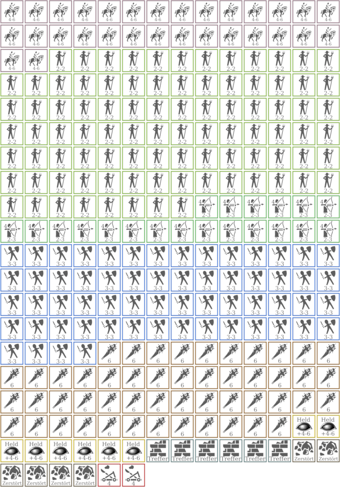

## Ogerschlacht Remake

In meiner aktuellen DSA-Kampagne spielen wir in Vorbereitung auf die _Sieben Gezeichneten_ einige alte Abenteuer-Klassiker. Eines dieser Abenteuer war [_Mehr als 1000 Oger_](https://de.wiki-aventurica.de/wiki/Mehr_als_1000_Oger) von Ulrich Kiesow, das das Mini-Strategiespiel _Die Schlacht bei den Trollzacken_ enthält.  
Hierbei handelt es sich um um ein, auf zwei Letterseiten abgedrucktes, Spielfeld mit einigen Spielmarkern, mit dem man die legendäre [Ogerschlacht](https://de.wiki-aventurica.de/wiki/Ogerschlacht) nachspielen kann. Aus heutiger Sicht ist so ein Strategiespiel, das völlig mit dem eigentlichen Rollenspiel bricht, zwar recht veraltet, doch da meine Spieler eh gerne Strategiespiele spielen und wir mit so alten Abenteuern wie [_Die Göttin der Amazonen_](https://de.wiki-aventurica.de/wiki/Die_G%C3%B6ttin_der_Amazonen) und [_Die Verschwörung von Gareth_](https://de.wiki-aventurica.de/wiki/Die_Verschw%C3%B6rung_von_Gareth) eh dabei sind, DSA-Geschichte zu erleben, wollte ich das Spiel gerne umsetzen.

### Das Problem

Da das Abenteuer 1988 für DSA2 erschien, ist es in physischer Form entsprechend vergriffen und nur recht teuer auf Ebay zu ersteigern. Glücklicherweise kann man jedoch bei [Ulisses-Ebooks](https://www.ulisses-ebooks.de/product/124758/) viele alte Abenteuer als PDF kaufen, auch _Mehr als 1000 Oger_.

Diese PDF-Versionen sind Scans der alten Abenteuer und dadurch leider nicht immer ganz perfekt, was die Qualität angeht. Im Fall dieses Abenteuers ist die Qualität des Spielfeldes recht schlecht, und Feld-Beschriftungen schon in normaler Größe nur schlecht lesbar.  
Doch es gibt noch ein weiteres Problem mit dem Spielfeld, das mich noch mehr gestört hat: Die Größe.

Zwei Letterseiten mit insgesamt 39x24 Hex-Feldern sind schon grenzwertig klein, wenn man nur 3 Spieler hat, aber in meinem Fall hatte ich für dieses Abenteuer 7 Spieler, die alle zusammen mit mir an einem Tisch sitzen würden. Bei der originalen Größe, könnten vermutlich maximal 2 Leute etwas erkennen, alle anderen nicht. Eher ungünstig, wenn es darum geht, mit einer ausgeklügelten Taktik das Mittelreich vor mehr als 1000 Ogern zu retten.

Dazu kam die größe der Tokens. Sie sind im Original einfach zu groß und bedecken in ihrer quadratischen Form mehr als nur ein Hex-Feld.

Die Lösung war, das Spiel nachzubauen, aber in größer und besser.

## Das Spielfeld

Zuerst musste ich mir ein großes Hex-Grid bauen. Dazu benutzte ich das kostenlose open-source Tool [mkhexgrid](http://www.nomic.net/~uckelman/mkhexgrid/). Das ist für praktisch jede Plattform verfügbar und funktioniert problemlos, auch wenn das letzte Update von 2007 ist.
Nachdem ich etwas mit der config herumgespielt hatte, konnte ich mir schließlich das Raster generieren.

Hier ist meine Einstellungen:

```
columns = 39
rows = 24
image-width = 9933
image-height = 7016
image-margin = 50
centered = true
grid-grain = v
grid-thickness = 3

output = png
outfile = grid.png
antialias = true

coord-bearing = 90
coord-distance = 100
coord-format = %tC%02r
coord-size = 16
```

Mit [Gimp](https://gimp.org) habe ich schließlich das entstandene Bild bearbeitet und Gebirge, Wälder, Hügel, Mauer und die Reichstraße hinzugefügt. Den riesigen Rundenzähler habe ich weggelassen, man kann ihn viel einfacher durch einen W20 oder einen kleinen Papierzettel ersetzen.

Das fertige Spielfeld sah nun so aus:

[](../files/spielplan.png)

Jetzt hatte ich zwar ein riesiges Bild, aber irgendwie musste ich es noch auf mehrere Seiten drucken und wieder zusammenkleben können. Dazu benutzte ich das freie open-source Tool [PosteRazor](http://posterazor.sourceforge.net/). Damit ist es möglich, Bilder so auf mehrere A4 Seiten zu zerlegen, dass sie sich am Rand etwas überlappen und so einfacher zusammenzukleben sind.

Meine Druckversion kann man [hier als PDF herunterladen](../files/spielplan-poster.pdf).

## Die Tokens

Die Original-Tokens hätte ich zwar verwenden können, aber sie haben im Original einen komplett farbigen Hintergrund, der mir nicht besonders gefällt. Kurzerhand habe ich mit [Token Tool](http://www.rolladvantage.com/tokenstamp/) eigene erstellt. Die Icons sind von [GameIcons.net](https://game-icons.net/) unter [CC BY 3.0](https://creativecommons.org/licenses/by/3.0/) Lizenz:
- [Delapouite](delapouite.com) (Bogenschütze, Reiter, Bauer, halb zerstörte Mauer, zerstörte Mauer, Ogerkeule)
- [HeavenlyDog](https://www.gnomosygoblins.blogspot.com/) (Ogerlöffel)
- [Cathelineau](https://game-icons.net/) (Schwertkämpfer)

Das Logo des Schwarzen Auges auf den Helden-Tokens ist von [hier](https://zeilenschmied.files.wordpress.com/2011/07/schwarzes-auge.png).

Die fertigen Tokens sehen so aus:

[](../files/tokens.png)

Die Druckversion kann man [hier herunterladen](../files/tokens.pdf)

## Regeln und Tabellen

Die Regeln und die Würfeltabellen waren mir zu unübersichtlich, weshalb ich ersteres nochmal kürzer aufgeschrieben und zweitere auf einer einzigen Seite zusammengefasst habe.

Regeln (Kurzfassung): [PDF](../files/ogerschlacht-regeln.pdf)  
Würfeltabellen: [PDF](../files/ogerschlacht-würfeltabellen.pdf)

## Hals Brief

Dieser hat zwar nichts direkt mit der Schlacht an den Trollzacken zu tun, aber ich habe ihn auch überarbeitet:

Der Brief, den Hal an die Fürstin von Rommilys schickt, ist im Abenteuer magisch verschlüsselt. Darauf kommen die Spieler aber sofort, wenn sie den Anfang des Briefes gelesen haben.  
Weil mir das als Verschlüsselung für eine kaiserliche Geheimbotschaft etwas zu einfach war und ich die Spieler noch etwas weiter rumrätseln lassen wollte, habe ich ihn zusätzlich noch per [Caesar-Verschlüsselung](https://de.wikipedia.org/wiki/Caesar-Verschl%C3%BCsselung) verschlüsselt.

Den Brief gibt es in drei Varianten: Die erste ist unverschlüsselt und sollte den Spielern gegeben werden, sobald sie das Schema der Verschlüsselung durchschaut haben. Die zweite ist normal verschlüsselt (Caesar-Verschlüsselung) und die dritte ist auch noch magisch unleserlich gemacht.

Download: [PDF](../files/hals-brief.pdf)
