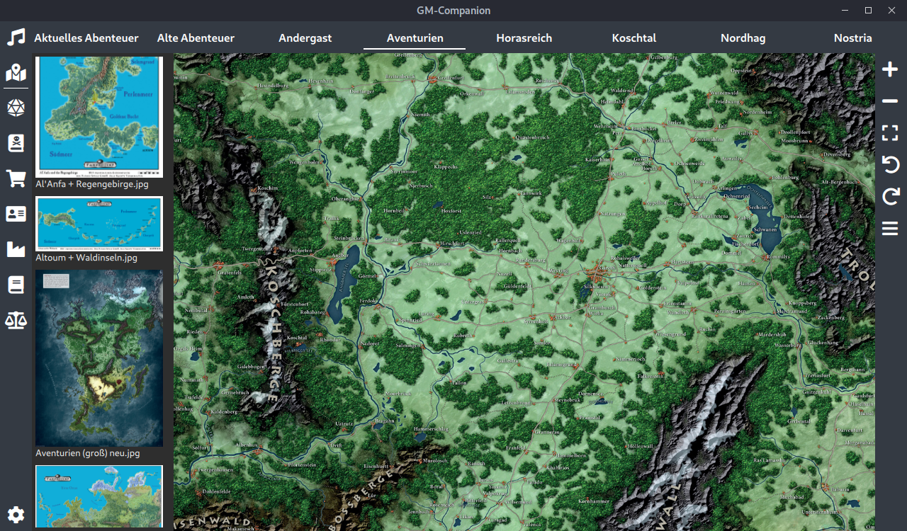
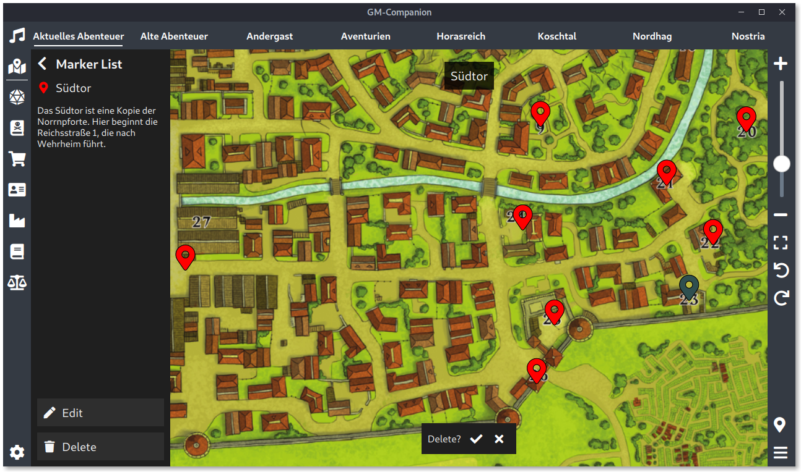

The GM-Companion has a really basic and map tool. I created it because I wanted to have an integrated image viewer and until recently I have not needed a more complex solution.

The current tool looks like this:

One can zoom in and out and also rotate the image.

However when I started to prepare the next adventure of my campaign, which takes place in one large city most of the time, I realised I need a way to quickly find important places and to add notes to them. Also the the current solution always zooms into the center of the map which was kind of annoying.

## Zooming

I wanted the new zoom to

* Scale from the visible center of the map
* Have smaller steps (the current solution always zooms by a factor of 2)

Thankfully I found a great [example project](https://github.com/oniongarlic/qtquick-flickable-image-zoom/) by [oniongarlic](https://github.com/oniongarlic) on github that I could adapt to my needs.

It fixed the centering and by simply changing the step size parameter I could also have smaller steps. However switching to a smaller step size meant that zooming in on large images took way too many clicks. The simple solution was to add a slider.

## Markers

First of all I had to decide how I wanted to save the markers. I have been playing with the idea of combining all tool-specific projects to one big master project file, but I am still unsure about it. For now every map is kind of it's own project and has a seperate file. It is named like the image file, except it ends with _.json_. `Example: a-great-map.png.json`

This file contains information about the markers:
* name
* description
* x and y coordinates
* icon ([FontAwesome](https://fontawesome.com/))
* icon color

I also created a basic marker editor:

Now location markers can be placed on a map. One can give the location a name and a description, choose an icon from a list and set a color (predefined one or custom).

I experimented with different ways to display the location name. My first solution was to have a label attached to the marker that showed whenever the mouse hovered above the marker. In most cases this worked well like in the next image.

However when there are multiple markers next to each other, visibility suffers.

So I decided to have the label centered at the top of the map window.

My screenshot did not capture the mouse cursor, so you can't see which marker is selected, but I think it is better now.

I also added a small dialog frame that is anchored at the bottom of the map window, where a marker can be deleted. It can be opened by doing a right click on a marker or by clicking "Delete" in the marker menu that opens when a marker is selected.

That's it. Let's see how this works in action, hopefully I can test the tool in a session this month.
