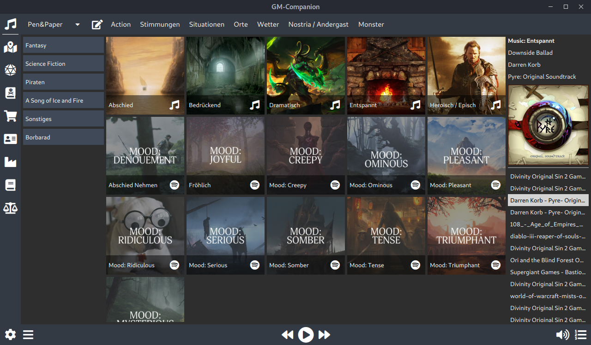

A tool I wrote (and am still writing) for running tabletop rpgs.  
I like to play tabletop rpgs and often I am the gamemaster. It's often a lot of work that usually pays off, but I am always looking for ways to simplify things and if there is no pre-made solution that I like, I have to build one myself. And then things like this happen. 

## About

The GM-Companion is a free and open source desktop application written in C++/Qt and QML. Originally I started this project because I needed a simple tool for Linux that can play different music playlists at the table with as few clicks as possible.

Since then the project has evolved and has gone through many changes. The source code is available at [GitHub](https://github.com/PhilInTheGaps/GM-Companion).

[Project Website](https://gm-companion.github.io)

## Features

### Audio

Playing music playlists is still one of the core features, but the program can not only play local music files, but internet radio streams and spotify playlists can also be played, as well as sounds. And for those who don't want to have their music library on their laptop, music and sounds can be streamed from Google Drive.

### Maps

Maps are one of those things that one always needs when running a campaign. And even though the GM-Companion can not be used to create maps, you can still view them and that is in my opinion better than opening a second program.

### Dice

Most games use dice in some form. Sure, physical dice are way better (and more satisfying to use) than virtual ones, but sometimes there is not enough table space or you have to ensure that there is no way that the players can see the result.

### Combat Tracker

Combat can be complicated and it is easy to forget the turn order. This tool can be used to keep track of it.

### Shops

Your players want to know everything that's on the tavern's menu or a list of all the items a person on the market sells? Plan and create those lists beforehand with this tool.

### Character Sheets

I like have a virtual copy of all the character sheets. They can be easily viewed with this tool.

### Name Generator

This should need no explanation. There can only be so many NPCs named Bob and John in a world. 

### Converter

You play a system with confusing value conversions? 17 coppers are one silver and 11 of those one gold and you can not remember the exact values? This is your tool. (I really needed it for _A Song of Ice and Fire Roleplaying_ ...)
